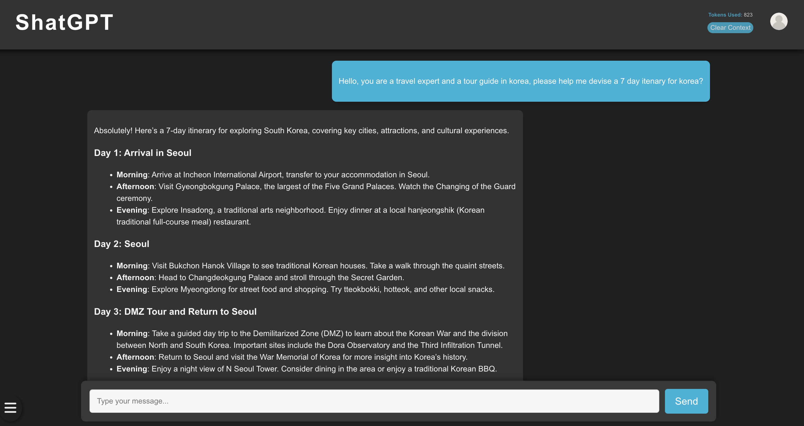
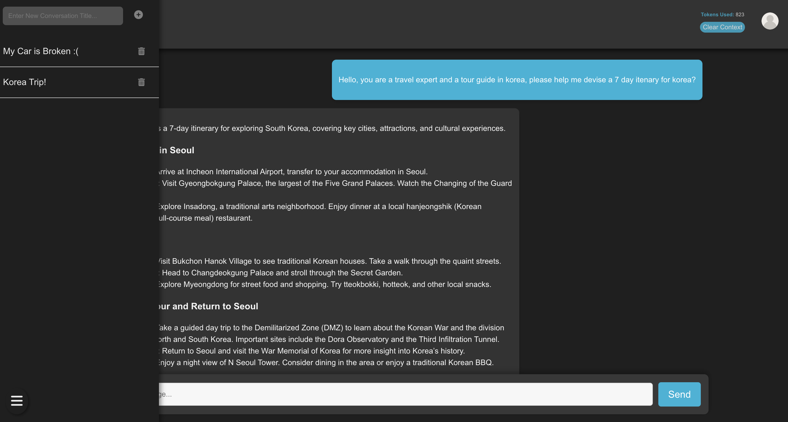

# Chatbot Application

This repository contains the source code for a chatbot application with user authentication and a modern UI inspired by ChatGPT. The application leverages React for the frontend and Axios for API communication with the backend and database. The whole webapp uses a MERN tech stack. 


---

## Features

### General
- **Responsive UI:** A user interface designed to mimic the sleek and intuitive design of ChatGPT.
- **Dark Theme:** A visually pleasing dark mode with subtle contrasts.

### Chat Functionality
- **Send Messages:** Users can type and send messages to interact with the chatbot.
- **Dynamic Replies:** The chatbot processes user input and returns appropriate responses.
- **Contextual Conversations:** User conversations are saved into MongoDB for maintaining of context.
- **Conversations Bar:** Enables the Storage of multiple conversations.
- **Token Tracking:** Displays the number of tokens used for processing each reply.

### Authentication
- **Signup Page:** Users can log in to access the chatbot. 
- **Login Page:** Users can log in to access the chatbot.
- **Auth Context:** Authentication state managed globally via React Context API.
- **Logout Functionality:** Users can securely log out from the application.





## Server Structure and Responsibilities

### **Frontend Server: React**
- The **React** frontend is responsible for all client-side interactions, including:
  - Rendering the user interface.
  - Handling user input and sending requests to the backend.
  - Displaying responses from the backend and LLM server.

### **Backend Server: Node.js with Express**
- The **Node.js** backend, powered by **Express**, serves as the intermediary between the frontend and the LLM server.
- Key responsibilities include:
  - Parsing and validating incoming user input.
  - Managing database interactions for user authentication and state persistence.
  - Forwarding user queries to the LLM server and processing responses.
  - Implementing error handling and ensuring secure communication.

### **LLM Server: Python**
- The **Python** server is responsible for interacting with the **Large Language Model (LLM)**, which provides chatbot functionalities.
- Key responsibilities include:
  - Receiving processed input from the backend server.
  - Generating responses using the LLM.
  - Calculating token usage or other metrics for analytics purposes.
  - Sending structured responses back to the backend server.

This structured approach ensures a seamless and efficient interaction between the user, frontend, backend, and LLM server, maintaining clear separation of concerns and scalability.

## Instructions to Run SHATGPT App

To run the **SHATGPT** app, you need to start three servers: the **backend server**, the **frontend server**, and the **LLM (Large Language Model) server**.

## Prerequisites

Ensure you have the following installed on your machine:

- **Node.js** (for both frontend and backend servers)
- **Python** (for LLM server)
- **npm** (Node.js package manager)
- **nodemon** (for backend server hot reloading)

---

## Step-by-Step Setup

### 1. Clone the Repository

First, clone the repository to your local machine:

```bash
git clone <https://github.com/syd9191/shatGPT.git>
cd SHATGPT
```

### 2. Start the Backend Server

Open a new terminal window and navigate to the backend directory:
```bash
cd backend
```

Install all dependencies:
```bash
npm install
```

Create .env using the .env-copy: Fill in your own mongodb url
```bash 
   cp .env-copy .env
```

Run the backend server with nodemon for hot reloading:
```bash
nodemon
```

### 3. Start the Frontend Server

Open a new terminal window and navigate to the frontend directory:
```bash
cd frontend
```

Install all dependencies:
```bash
npm install
```

Run the frontend server:
```bash
npm start
```

### 4. Start the LLM Server

Open a third terminal window and navigate to the LLMServer directory:
```bash
cd LLMServer
```

Create .env using the .env-copy: Fill in your own Openai APIKEY
```bash 
   cp .env-copy .env
```

Install the required dependencies: Install the necessary dependencies by running the following command, which will use the requirements.txt file:
```bash
pip install -r requirements.txt
```

Run the LLMserver
```bash
python LLMserver.py
```


